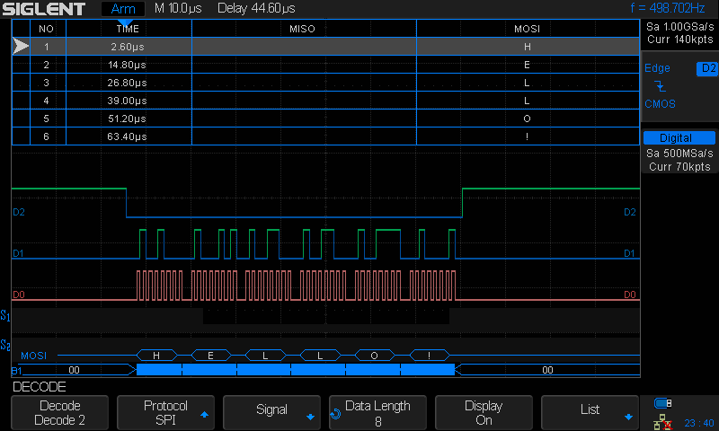

.. _stm32-spi:

stm32-spi
#########

Overview
********
A simple example of using an *STM32 Nucleo-F411RE* board to transfer data over
the SPI bus.

Building and Running
********************

First set up *Zephyr* according to its `Getting Started Guide <https://docs.zephyrproject.org/latest/getting_started/index.html#getting-started>`_ using its *West* tool.

For this project I haven't used the `Zephyr SDK <https://docs.zephyrproject.org/latest/getting_started/installation_linux.html#install-the-zephyr-software-development-kit-sdk>`_, rather (on Ubuntu/cosmic) just followed the `Building on Linux without the Zephyr SDK <https://docs.zephyrproject.org/latest/getting_started/installation_linux.html#building-on-linux-without-the-zephyr-sdk>`_ by installing *gcc-arm-none-eabi* and setting *CROSS_COMPILE* and *ZEPHYR_TOOLCHAIN_VARIANT*
accordingly (done by `configure.sh <https://github.com/ideak/zephyr-stm32-spi/blob/master/configure.sh>`_ below, for details see the *Zephyr* documentation).

Based on the above after installing *Zephyr* and *gcc-arm-none-eabi*, you can just run inside the checked out dir of this repo:

.. code:: bash

        $ configure.sh

to create the *build* dir and the build scripts within. Then - either initially or whenever you change the source:

.. code:: bash

        $ cd build
        $ ninja
        $ ninja flash

to build and flash the image to your board.

Going further you may also want to customize the *Zephyr* core configuration - and then rebuild the image as you did above - with:

.. code:: bash

        $ ninja menuconfig

for instance to enable debugging, choose another SPI module instead of SPI1 the app uses by default, or just to get furhter ideas of all the cool stuff you can do with *Zephyr*. Or just to have a Déjà vu experience ;)

See the comment in `src/main.c <https://github.com/ideak/zephyr-stm32-spi/blob/master/src/main.c>`_ for details about the board specific SPI pin config and MCU specific low-level bus programming (both taken care for us by the *Zephyr* core).

You may also find it useful to read about the *Nucleo-F411RE* board's `pinout layout <https://os.mbed.com/platforms/ST-Nucleo-F411RE>`_, `schematic <https://www.st.com/resource/en/schematic_pack/nucleo_64pins_sch.zip>`_, `user manual <https://www.st.com/resource/en/user_manual/dm00105823.pdf>`_ and the *STM32-F411RE* MCU's `datasheet <https://www.st.com/resource/en/datasheet/stm32f411ce.pdf>`_ and `reference manual <https://www.st.com/resource/en/reference_manual/dm00119316.pdf>`_.

Sample Output
=============
.. code:: bash

        $ cu -l /dev/ttyACM0
        Connected.
        ***** Booting Zephyr OS zephyr-v1.14.0-719-gbba534299244 *****
        Starting stm32-spi on nucleo_f411re

